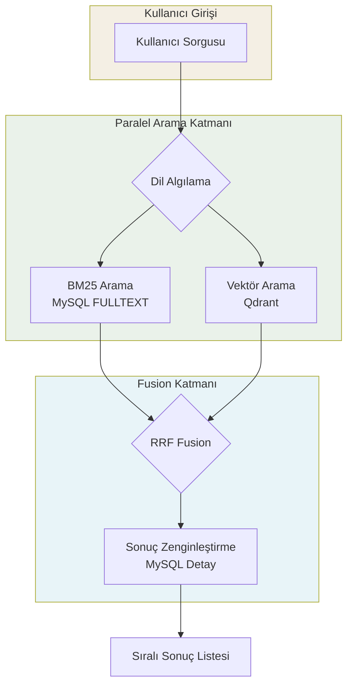
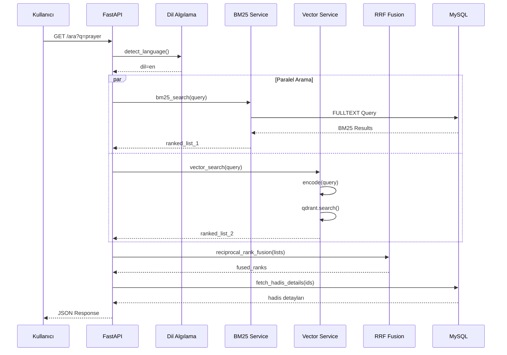
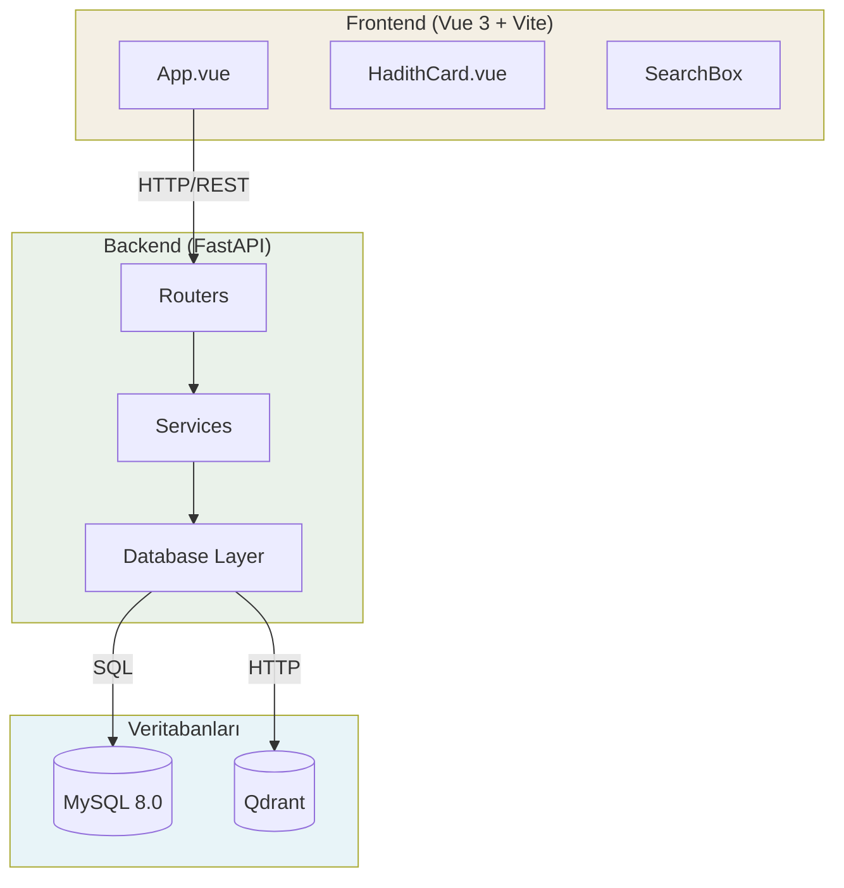

# 📖 HadithSearch — Hadis Arama Platformu

<div align="center">
  
</div>

**HadithSearch**, Sahih Bukhari külliyatındaki **7.277 hadisi** Arapça ve İngilizce olarak arayabileceğiniz, modern bir web arama platformudur. Hibrit arama teknolojisi ile hem klasik kelime eşleşmesi hem de anlamsal benzerlik araması sunar.

---

## 🌟 Özellikler

| Özellik | Açıklama |
|---------|----------|
| 🔍 **3 Arama Modu** | Hybrid (BM25+Semantik), Vektör (Semantik), BM25 (Kelime) |
| 🕌 **7.277 Hadis** | Sahih Bukhari'nin tamamı indekslenmiştir |
| 🌐 **Çift Dil** | Arapça ve İngilizce sorgu desteği, otomatik dil algılama |
| 🎯 **RRF Fusion** | Reciprocal Rank Fusion ile akıllı sonuç birleştirme |
| 📱 **Modern UI** | Vue 3 + Tailwind CSS ile responsive tasarım |
| ⚡ **Hızlı Sorgu** | Paralel arama ve asenkron veritabanı erişimi |

---

## 🔍 Arama Mimarisi

Sistem, en doğru sonuçları getirmek için **BM25** (MySQL FULLTEXT) ve **Semantik Arama** (Qdrant Vektör DB) sonuçlarını **RRF (Reciprocal Rank Fusion)** ile birleştirir.

### Arama Akışı



### Detaylı Veri Akışı



### Arama Modları

| Mod | Açıklama | Kullanım Alanı |
|-----|----------|----------------|
| `hybrid` | BM25 + Vektör + RRF | Genel arama (varsayılan) |
| `vector` | Sadece semantik arama | Anlam benzerliği önemliyse |
| `bm25` | Sadece kelime eşleşmesi | Tam eşleşme gerekiyorsa |

---

## 🏗️ Proje Yapısı

### Sistem Bileşenleri



### Klasör Yapısı

```
AL_Hadith/
├── backend/                    # FastAPI Backend
│   ├── app/
│   │   ├── main.py            # API giriş noktası
│   │   ├── config.py          # Ortam değişkenleri
│   │   ├── database/          # SQLAlchemy modelleri
│   │   ├── routers/           # API endpoint'leri
│   │   │   ├── search.py      # /ara endpoint
│   │   │   ├── auth.py        # JWT authentication
│   │   │   └── hadith.py      # Hadis detay endpoint
│   │   └── services/          # İş mantığı
│   │       ├── hybrid_service.py   # RRF fusion
│   │       ├── bm25_service.py     # MySQL FULLTEXT
│   │       └── vector_service.py   # Qdrant arama
│   ├── scripts/
│   │   ├── init.sql           # Veritabanı şeması
│   │   └── import_data.py     # CSV → MySQL import
│   ├── requirements.txt
│   └── Dockerfile
├── frontend/                   # Vue 3 Frontend
│   ├── src/
│   │   ├── App.vue            # Ana uygulama
│   │   ├── components/        # Vue bileşenleri
│   │   └── services/          # API servisleri
│   ├── package.json
│   └── index.html
├── veriler csv/               # Hadis veri setleri
│   ├── bukhari_arabic.csv
│   └── bukhari_english.csv
├── docker-compose.yml         # Container orchestration
├── .env.example               # Çevre değişkenleri şablonu
└── docs/                      # Proje dokümantasyonu
    ├── SYSTEM_ARCHITECTURE.md
    ├── API_DOCUMENTATION.md
    ├── DATABASE_DESIGN.md
    └── VECTOR_SEARCH_PIPELINE.md
```

---

## 🚀 Hızlı Başlangıç

### Gereksinimler

| Yazılım | Minimum Sürüm |
|---------|---------------|
| Docker Desktop | 24.0+ |
| Node.js | 18.0+ |
| Python | 3.11+ |

### Kurulum

```bash
# 1. Ortam değişkenlerini ayarla
cp .env.example .env

# 2. Veritabanlarını başlat
docker compose up -d db qdrant

# 3. Backend bağımlılıklarını yükle
cd backend
pip install -r requirements.txt

# 4. Verileri import et (ilk kurulumda)
python scripts/import_data.py

# 5. API'yi başlat
uvicorn app.main:app --reload

# 6. Frontend'i başlat (yeni terminal)
cd ../frontend
npm install
npm run dev
```

### Servisler

| Servis | URL | Açıklama |
|--------|-----|----------|
| Web Arayüzü | http://localhost:5173 | Vue.js uygulaması |
| API | http://localhost:8000 | FastAPI endpoints |
| API Docs | http://localhost:8000/docs | Swagger UI |
| Qdrant | http://localhost:6333 | Vektör veritabanı |

---

## 🔌 Temel API Kullanımı

### Arama

```bash
# İngilizce arama (hybrid mod)
curl "http://localhost:8000/ara?q=prayer&dil=en&mod=hybrid"

# Arapça arama (vektör mod)
curl "http://localhost:8000/ara?q=الصلاة&dil=ar&mod=vector"

# Sayfalama ile
curl "http://localhost:8000/ara?q=fasting&sayfa=2&limit=10"
```

### Response Format

```json
{
  "sorgu": "prayer",
  "dil": "en",
  "mod": "hybrid",
  "sayfa": 1,
  "toplam": 156,
  "sonuclar": [
    {
      "id": 123,
      "hadis_no": "BH-456",
      "kitap": "Sahih al-Bukhari",
      "bab": "Book of Prayer",
      "ravi": "Abu Huraira",
      "kaynak_link": "https://sunnah.com/bukhari:456",
      "arapca": {
        "sanad": "حَدَّثَنَا...",
        "hadith_detail": "إِنَّمَا الأَعْمَالُ..."
      },
      "ingilizce": {
        "sanad": "Narrated by...",
        "hadith_detail": "The deeds are..."
      },
      "skor": 0.854321
    }
  ]
}
```

---

## 📦 Teknoloji Stack

| Katman | Teknoloji | Amaç |
|--------|-----------|------|
| **Frontend** | Vue.js 3 + Vite | UI framework |
| **Stil** | Tailwind CSS 4.x | CSS framework |
| **Backend** | FastAPI 0.115+ | API framework |
| **Database** | MySQL 8.0 | Metadata + FULLTEXT |
| **Vector DB** | Qdrant 1.12+ | Semantik arama |
| **ORM** | SQLAlchemy 2.0+ | Veritabanı erişimi |
| **Auth** | python-jose + bcrypt | JWT authentication |
| **NLP** | sentence-transformers | Embedding üretimi |
| **Container** | Docker + Compose | Altyapı yönetimi |

---

## � Dokümantasyon

Detaylı teknik dokümantasyon `docs/` klasöründe:

- **[SYSTEM_ARCHITECTURE.md](docs/SYSTEM_ARCHITECTURE.md)** - Sistem mimarisi ve veri akışı
- **[API_DOCUMENTATION.md](docs/API_DOCUMENTATION.md)** - Tüm API endpointleri
- **[DATABASE_DESIGN.md](docs/DATABASE_DESIGN.md)** - Veritabanı şeması ve ilişkiler
- **[VECTOR_SEARCH_PIPELINE.md](docs/VECTOR_SEARCH_PIPELINE.md)** - Vektör arama süreci

---

## 🧪 Test

```bash
# API sağlık kontrolü
curl http://localhost:8000/

# Arama testi
curl "http://localhost:8000/ara?q=charity&dil=en&limit=5"

# Hadis detayı
curl "http://localhost:8000/hadis/1"
```

---

## 👥 Geliştirici Ekibi

Bu proje, **Ostim Teknik Üniversitesi** öğrencileri tarafından geliştirilmiştir.

📬 İletişim:
- 230205913@ostimteknik.edu.tr
- 230205928@ostimteknik.edu.tr

---

## 📄 Lisans

Bu proje eğitim amaçlı geliştirilmiştir. Hadis içerikleri kamuya açık kaynaklara dayanmaktadır.
